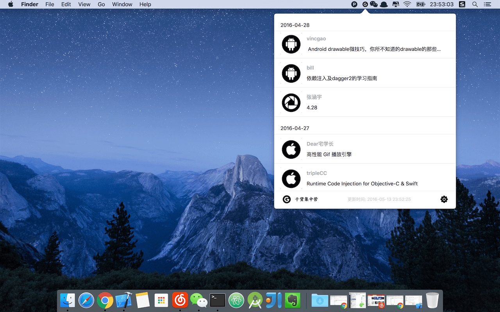
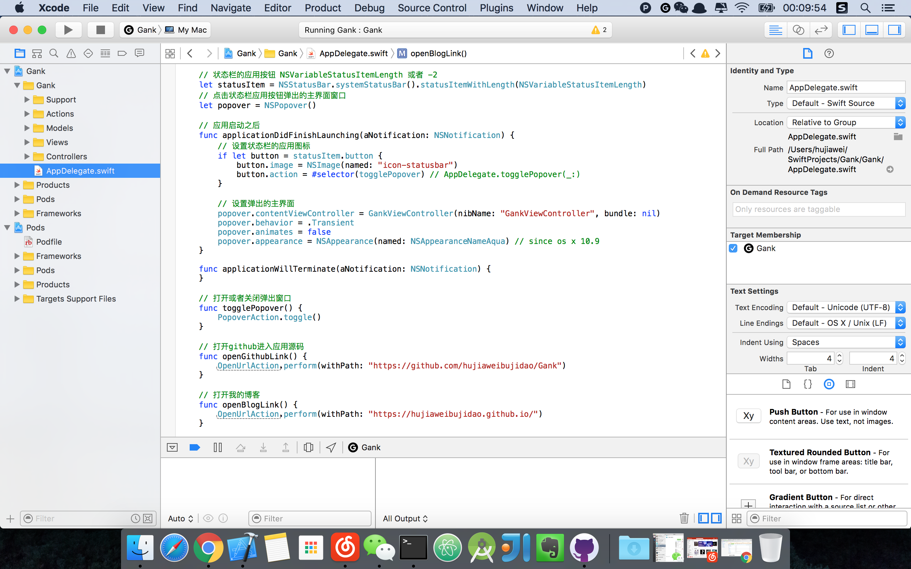
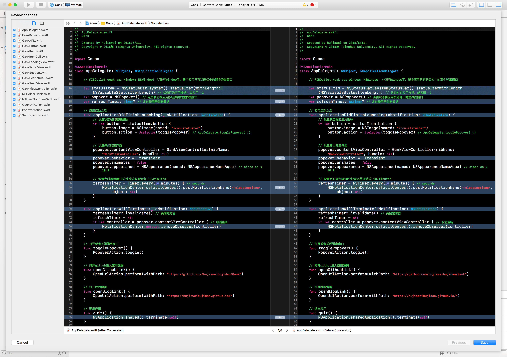
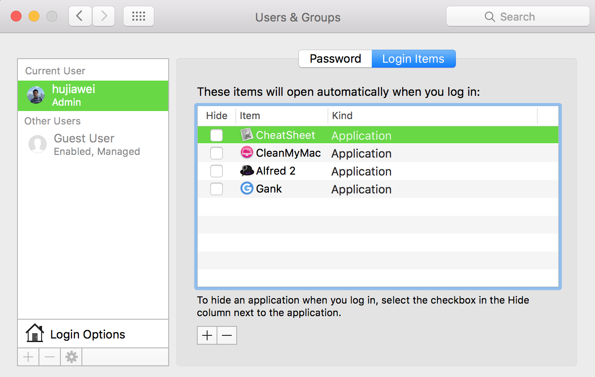

[README in English](README-EN.md)  [](https://github.com/hujiaweibujidao/Gank-for-Mac/releases)  

# Gank for Mac

> The missing Mac OS X application for [gank.io](https://gank.io).

Gank for Mac是一个小巧的干货集中营Mac端应用，它只在你的状态栏占据一点点空间而已。

[应用下载地址](https://github.com/hujiaweibujidao/Gank/releases)

如果你对我的开发工作感兴趣的话记得在Github上Follow我哟，或者关注[我的博客](http://javayhu.me/)。

## 应用功能

Gank for Mac的功能包括查看[干货集中营](https://gank.io)今天或者以前的干货数据，同时在应用启动的情况下，当有新的干货到来的时候会推送通知给你喂食哟，麻麻为了不让你饿着真是操碎了心。当然，你再也不用担心抢不到评论区的沙发啦！😚   

应用在加载数据的时候会显示菊花，加载失败的时候会显示出错并提供重载按钮。

Gank for Mac使用的是 [Swift](https://swift.org/) 3 开发的，Mac系统版本要求10.10及以上，应用截图如下：



由于是第一次写Mac OS X应用，所以项目源码基本上都注释得很清楚，但是不保证代码写得非常好，所以哪块代码要是没写好请轻拍哈。当然，欢迎提交PR或者提建议，比如加上提交干货的功能。😘


 
2017/6/10 周末过来公司抽空将Swift升级到3.0版本
 


## 数据+依赖+资源

1.[gank.io](http://gank.io/) and its [API](http://gank.io/api): 每日分享妹子图和技术干货  
2.[Alamofire](https://github.com/Alamofire/Alamofire): Elegant HTTP Networking in Swift  
3.[SwiftyJSON](https://github.com/SwiftyJSON/SwiftyJSON): The better way to deal with JSON data in Swift  
4.[SwiftyTimer](https://github.com/radex/SwiftyTimer): Swifty API for NSTimer  
5.图片来源于[IconFinder](https://www.iconfinder.com/)，主要是[这个图标集合](https://www.iconfinder.com/iconsets/picons-social)

## 参考项目

1.[Product Hunt](https://github.com/producthunt/producthunt-osx)  
2.[Toutiao for Mac](https://github.com/judi0713/TouTiao)

### FAQ

#### 1.妹子图在哪里呢？

我就知道你只关心妹子！！！🙈 为了应用的简洁，点击妹子图或者休息视频会进入那天的干货日报界面。

#### 2.后台自动刷新的时间间隔设置的是多久？

默认是10分钟，如果你觉得不合适可以自己改改源码重新生成一个应用哈。

#### 3.为啥没有开机自启动？

应用的开机自启动可以在`System Preferences`中设置的嘛，别以为我不知道！😌

<!---->

## The License

```
The MIT License (MIT)

Copyright (c) 2016 Hujiawei

Permission is hereby granted, free of charge, to any person obtaining a copy
of this software and associated documentation files (the "Software"), to deal
in the Software without restriction, including without limitation the rights
to use, copy, modify, merge, publish, distribute, sublicense, and/or sell
copies of the Software, and to permit persons to whom the Software is
furnished to do so, subject to the following conditions:

The above copyright notice and this permission notice shall be included in all
copies or substantial portions of the Software.

THE SOFTWARE IS PROVIDED "AS IS", WITHOUT WARRANTY OF ANY KIND, EXPRESS OR
IMPLIED, INCLUDING BUT NOT LIMITED TO THE WARRANTIES OF MERCHANTABILITY,
FITNESS FOR A PARTICULAR PURPOSE AND NONINFRINGEMENT. IN NO EVENT SHALL THE
AUTHORS OR COPYRIGHT HOLDERS BE LIABLE FOR ANY CLAIM, DAMAGES OR OTHER
LIABILITY, WHETHER IN AN ACTION OF CONTRACT, TORT OR OTHERWISE, ARISING FROM,
OUT OF OR IN CONNECTION WITH THE SOFTWARE OR THE USE OR OTHER DEALINGS IN THE
SOFTWARE.
```
